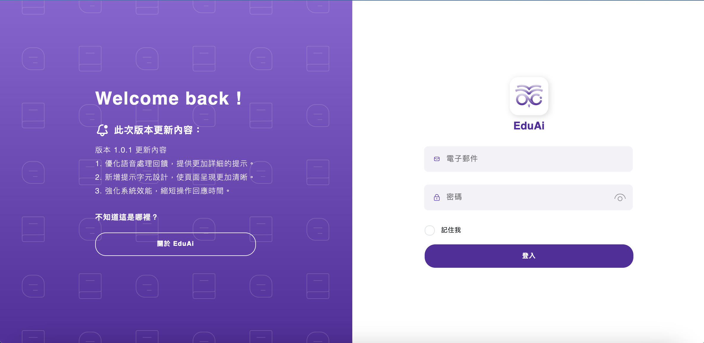

## EduAi

**EduAi** is a web application based on **Moodle** backend that allows teachers and students to access and manage their Moodle data through a web interface. It provides a user-friendly interface for students to view their **course information**, **discussion**, and even **interact with LLM**.   At the same time, **teachers** can upload **teaching plans**, get the **feedback**, and **analysis** of students' speech in the discussion. Which means teachers can easily understand the **students' learning status** and **adjust the teaching plan** in time.

This project is also derived from **NTNU Software Engineering Course**.

#### Features

- **Student Discussion**: View the current discussing problems in **real-time**, and analyze the speech of students with **speech-to-text** and LLM analysis.
- **Conversation**: Interact with large language models (LLMs) to get answers to questions or generate content.

- **Class Management**: Manage student **groups**, modify the **current question for discussion**, and get the **feedback** analyzed by **LLM** of the class.
- **Teaching Plan**: Upload teaching plans, and get the **feedback** analyzed by **LLM**.
- **Speech Analysis**: Analyze the speech of students in the discussion, and get the **feedback** analyzed by **LLM**.
- **User Management**: Manage user information, including **username**, **fullname**, **email**, and **password**.
- **Student Learning Analysis**: Analyze the learning status of students by **LLM**.

#### Getting Started

Developers or schools can easily build the server by **cloning** / **downloading** the whole repo, and run the server by 
`docker compose up -d`

You can interact the frontend at `localhost:3000`

backstage management system will be at `localhost:8080/moodle`

#### Technology Stack

- **Frontend**: **Node.js**
- **Backend**: **Moodle** + **Python Flask** 
- **Database**: **MySQL**
- **Speech-to-Text**: **Google Speech-to-Text API**
- **LLM Analysis**: **Groq API**

#### License

This project is licensed under the [Apache-2.0 License](LICENSE).

#### Contribution

Contributions are welcome! Please submit a pull request.

#### Contact

For any questions or issues, please open an issue. 

